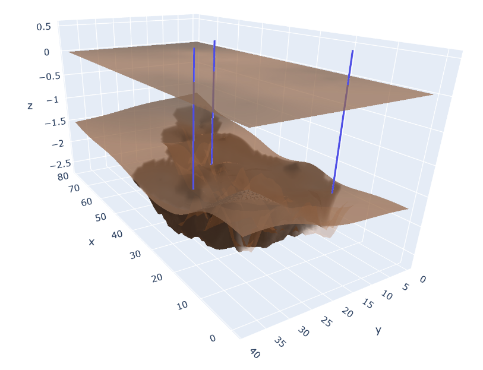

# Toy Oil Extraction Simulation
## Что это?
Данный репозиторий содержит "игрушечную" версию симуляции гидродинамической модели.
Обратите внимание на то, что симуляция не претендует на физическую точность и достоверность, ее целью является исключительно демонстрация задачи размещения нерегулярного фонда вертикальных скважин в гидродинамической модели с упрощенными свойствами и параметрами.

Симуляция рассчитывает изменение содержания нефти в залежах с учетом размещенных скважин, а также доход от добычи нефти и стоимость размещения скважин.

## Как с этим работать?
### Общая информация
На данный момент симуляция не имеет пользовательского интерфейса для решения  задачи размещения нерегулярного фонда экспертом.

У симуляции есть только программный интерфейс. Для работы с симуляцией настоятельно рекомендуется использовать класс `BaseBlackOilEnv` и его наследников. Все они могут быть найдены в модуле `src.envs.envs`.

### Запуск симуляции
Для запуска симуляции достаточно сделать следующее:
1. Создать объект класса `src.envs.envs.DummyBlackOilEnv` или `src.envs.envs.BlackOilEnv`.
2. У созданного объекта класса вызвать метод `.reset()`. Этот метод сгенерирует начальные условия симуляции в зависимости от выбранного окружения. Данный метод также вернет начальное представление состояния.
3. Выбрать местоположение скважины `(x, y)` на сетке координат. Значения координат должны иметь тип `int` и лежать в диапазоне от 0 до количества столбцов или строк.
4. Вызвать метод `.step((x, y))`. Данный метод добавит скважину в заданные координаты, после чего запустит симуляцию одного месяца добычи нефти. Он возвращает новое состояние окружения, чистую прибыль за месяц, а также флаг завершения эпизода (закончилась ли симуляция).
5. Если эпизод завершился (`done == True`), то необходимо вернуться к п. 2.

Обратите внимание, что симуляция настроена настроена таким образом, чтобы работать в интерактивном режиме. Это позволит вам собирать данные итеративно, обновляя агента между шагами симуляции.

### Описание состояния
Состояние окружения - трехмерный массив размера `HxWx8`. Первые два измерения соответствуют координатам `y` и `x` соответственно. Последнее измерение соответствует следующему набору признаков:
1. Глубина залегания нефти. Отражает то, насколько глубоко необходимо бурить скважину в данной точке, чтобы достигнуть резервуара с нефтью.
2. Сложность проницаемости. Отражает то, насколько сложно проводить буровые работы на данном участке. Влияет на стоимость размещения скважины.
3. Размер резервуара. Чем больше резервуар, тем больше в него может поместиться нефти.
4. Пористость резервуара. Чем меньше пористость, тем меньше нефти может поместиться в резервуар и тем сложнее ей перемещаться через него.
5. Текущее количество нефти в резервуаре
6. Максимально возможное количество нефти в резервуаре
7. Стоимость размещения скважины на данном учатске.
8. Наличие скважины на данном участке. `1` если скважина есть, `0` если скважины нет.

### Визуализация текущего состояния ГДМ
Для визуализации используется библиотека `plotly`. Чтобы визуализировать текущее состояние ГДМ, необходимо вызвать метод `.render()` у объекта окружения. Данный метод создаст откроет окно, в котором в трехмерном виде будет отображена гидродинамическая модель.

### Оценка результатов работы
Для оценки результатов лучше всего подойдет суммарная награда (суммарный чистый доход) за все время симуляции (т.е., за один полный эпизод). Однако поскольку для разных карт месторождений результаты могут быть различны, рекомендуется усреднить значение по нескольким эпизодам. Также рекомендуется проводить тестирование не только в конце обучения, но и в процессе обучения (например, раз в 10000 батчей).
